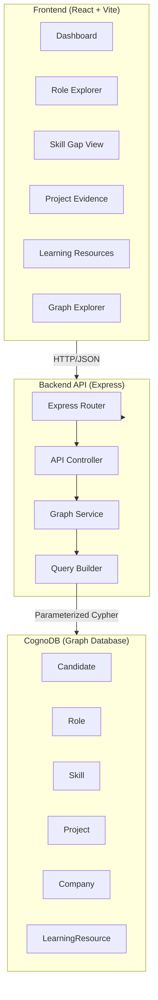
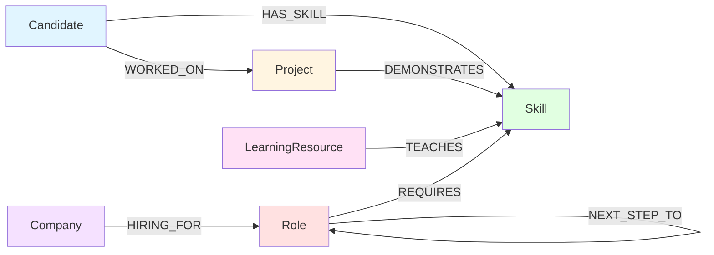
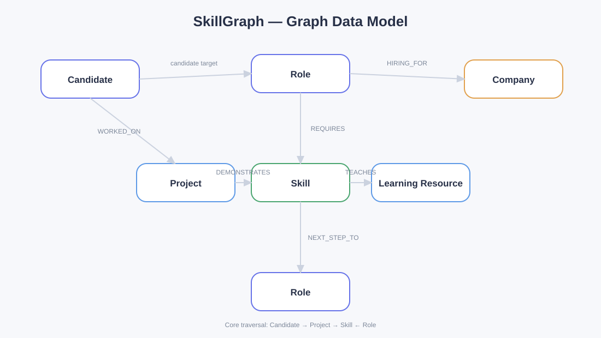
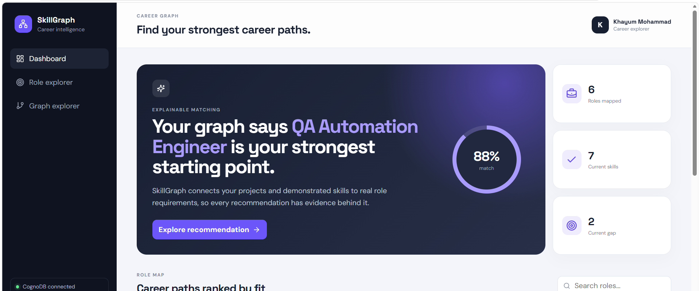
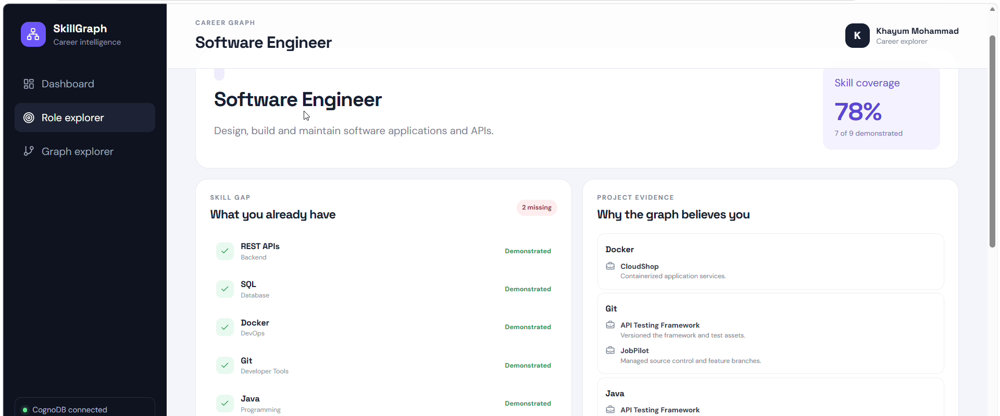
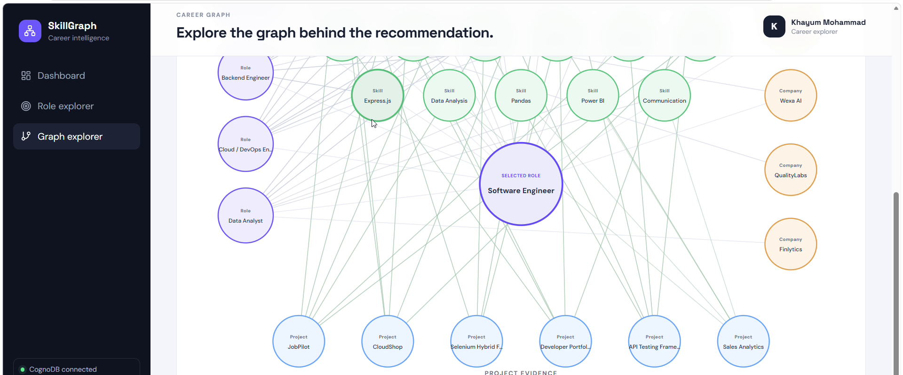

# SkillGraph — Explainable Career Path Explorer

A sophisticated graph database application that helps candidates explore career roles, understand skill requirements, identify skill gaps, trace skills back to projects, and discover learning resources. Built with [CognoDB](https://www.cognodata.com/), a managed graph database compatible with Neo4j and openCypher.

> Built for the Wexa AI take-home assignment: Build a Graph Database Application

## Table of Contents

- [Overview](#overview)
- [Why a Graph Database?](#why-a-graph-database)
- [Architecture](#architecture)
- [Data Model](#data-model)
- [Main Graph Queries](#main-graph-queries)
- [Setup](#setup)
- [Environment Variables](#environment-variables)
- [Project Structure](#project-structure)
- [API Endpoints](#api-endpoints)
- [Running the Application](#running-the-application)
- [Database Seeding](#database-seeding)
- [Deployment](#deployment)
- [Demo](#demo)

---

## Overview

SkillGraph is a relationship-rich application designed to help candidates make informed career decisions. The core insight is that career readiness is about understanding how:

- Your **projects** demonstrate **skills**
- Those **skills** map to **role requirements**
- **Roles** connect to **companies** hiring
- Missing **skills** link to **learning resources**
- **Roles** progress through **career paths**

Instead of flat, relational CRUD operations, SkillGraph uses **multi-hop graph traversals** to derive meaningful recommendations, explainable skill gaps, and learning paths. Every recommendation has evidence traceable through the graph.

### Key Features

- **Role Discovery**: Browse available roles with real-time skill match percentages
- **Explainable Recommendations**: AI-driven role suggestions backed by candidate project evidence
- **Skill Gap Analysis**: See exactly which skills you have, which you're missing, and how they connect to your goals
- **Project Evidence**: Trace demonstrated skills back to specific projects
- **Learning Resources**: Get curated resources for each missing skill
- **Graph Explorer**: Visualize multi-hop relationships in a career graph
- **Parameterized Queries**: All queries use parameters; zero SQL injection risk
- **CognoDB Native**: Uses official Neo4j JavaScript driver with Bolt protocol

---

## Why a Graph Database?

Career readiness is fundamentally a **relationship problem**. Consider the question:

> "Which roles can I pursue based on skills demonstrated through my projects, and what resources can help me close gaps?"

In a relational database, this requires **multiple joins**:

```sql
SELECT DISTINCT r.name
FROM candidates c
JOIN projects p ON c.id = p.candidate_id
JOIN project_skills ps ON p.id = ps.project_id
JOIN skills s ON ps.skill_id = s.id
JOIN role_skills rs ON s.id = rs.skill_id
JOIN roles r ON rs.role_id = r.id
WHERE c.id = ? AND r.id = ?;
```

In CognoDB with Cypher, the **relationships are first-class**:

```cypher
MATCH (c:Candidate {id: $candidateId})
      -[:WORKED_ON]->(p:Project)
      -[:DEMONSTRATES]->(s:Skill)
      <-[:REQUIRES]-(r:Role {id: $roleId})
RETURN DISTINCT
  s.name AS skill,
  p.name AS project,
  r.name AS role
```

This is not just syntactic sugar—**relationship traversal is the primary operation**. SkillGraph makes queries like these central to the product:

- **2+ hop paths** from Candidate → Project → Skill → Role
- **Missing skill traversals** from Role → Skill → LearningResource
- **Career progression paths** through Role → NEXT_STEP_TO → Role

These operations are expensive in relational databases but natural in graph databases.

---

## Architecture



### Technology Stack

**Frontend**
- React 19 with Hooks
- Vite (build tool)
- Lucide React (icons)
- Vanilla CSS (no frameworks)

**Backend**
- Node.js with Express 4
- neo4j-driver (official Neo4j JavaScript driver)
- dotenv (environment config)
- CORS (cross-origin requests)

**Database**
- CognoDB (managed graph database)
- Neo4j compatibility (Bolt protocol)
- openCypher query language

---

## Data Model

### Node Types

```
Candidate
├── id (unique)
├── name
├── headline
└── experienceYears

Role
├── id (unique)
├── name
├── description
├── category
└── seniority (level)

Skill
├── id (unique)
├── name
├── category
└── level

Project
├── id (unique)
├── name
├── description
└── difficulty

Company
├── id (unique)
├── name
└── industry

LearningResource
├── id (unique)
├── title
├── type (Course, Guide, Documentation, etc.)
├── difficulty
├── url
└── provider
```

### Relationship Types

```
(Candidate)-[:HAS_SKILL {level: String}]->(Skill)
  - Candidate possesses a skill at a given level

(Candidate)-[:WORKED_ON {role: String}]->(Project)
  - Candidate contributed to a project

(Project)-[:DEMONSTRATES {evidence: String}]->(Skill)
  - Project demonstrates (proves) a skill

(Role)-[:REQUIRES {importance: String}]->(Skill)
  - Role requires a skill (importance: essential or preferred)

(Company)-[:HIRING_FOR {openings: Integer}]->(Role)
  - Company is hiring for a role

(LearningResource)-[:TEACHES]->(Skill)
  - Resource teaches/covers a skill

(Role)-[:NEXT_STEP_TO {transitionDifficulty: String}]->(Role)
  - Role can progress to another role (career path)
```

### Graph Model Diagram



---

## Main Graph Queries

All queries use **parameterized Cypher** for safety.

### 1. Role Requirements vs. Candidate Skills

**Purpose**: Identify which required skills the candidate has/is missing

```cypher
MATCH (r:Role {id: $roleId})-[:REQUIRES]->(required:Skill)
OPTIONAL MATCH (c:Candidate {id: $candidateId})-[:HAS_SKILL]->(existing:Skill)
WITH required, collect(DISTINCT existing.id) AS existingSkillIds
RETURN
  required.id AS skillId,
  required.name AS skill,
  required.category AS category,
  CASE WHEN required.id IN existingSkillIds THEN true ELSE false END AS demonstrated
ORDER BY demonstrated DESC, category ASC
```

**Why graph-native**: Without graph traversal, joining candidate skills to role requirements requires multiple table lookups.

### 2. Multi-Hop Project Evidence (2+ Hops)

**Purpose**: Show projects as proof that candidate has required role skills

```cypher
MATCH (c:Candidate {id: $candidateId})
      -[:WORKED_ON]->(p:Project)
      -[:DEMONSTRATES]->(s:Skill)
      <-[:REQUIRES]-(r:Role {id: $roleId})
RETURN DISTINCT
  s.name AS skill,
  p.name AS project,
  r.name AS role
ORDER BY skill
```

**Why graph-native**: This 4-hop traversal (Candidate → Project → Skill ← Role) is central to explainability. A relational database would struggle with this multi-join pattern.

### 3. Learning Resources for Missing Skills

**Purpose**: Find resources for skills the candidate lacks

```cypher
MATCH (r:Role {id: $roleId})-[:REQUIRES]->(s:Skill)
OPTIONAL MATCH (c:Candidate {id: $candidateId})-[:HAS_SKILL]->(existing:Skill)
WITH s, collect(DISTINCT existing.id) AS existingSkillIds
WHERE NOT s.id IN existingSkillIds
MATCH (resource:LearningResource)-[:TEACHES]->(s)
RETURN
  s.id AS skillId,
  s.name AS skill,
  collect(DISTINCT {
    id: resource.id,
    title: resource.title,
    type: resource.type,
    difficulty: resource.difficulty,
    url: resource.url
  }) AS resources
ORDER BY skill ASC
```

**Why graph-native**: The `LearningResource → TEACHES → Skill` path is naturally expressed as relationship traversal.

### 4. Career Path Traversal

**Purpose**: Show possible role progressions

```cypher
MATCH (r:Role {id: $roleId})-[:NEXT_STEP_TO]->(nextRole:Role)
RETURN
  r.id AS currentRoleId,
  r.name AS currentRole,
  nextRole.id AS nextRoleId,
  nextRole.name AS nextRole,
  nextRole.level AS nextLevel
ORDER BY nextRole
```

**Why graph-native**: The `NEXT_STEP_TO` relationship represents career progression; a relational table would lose the semantic meaning.

### 5. Explainable Role Recommendations

**Purpose**: Rank roles by skill match percentage

```cypher
MATCH (c:Candidate {id: $candidateId})
MATCH (r:Role)-[:REQUIRES]->(s:Skill)
OPTIONAL MATCH (c)-[:HAS_SKILL]->(matched:Skill)
WITH r, s, collect(DISTINCT matched.id) AS candidateSkills
WITH r,
     count(CASE WHEN s.id IN candidateSkills THEN 1 END) AS matchedSkills,
     count(s) AS totalSkills
RETURN
  r.id AS id,
  r.name AS name,
  r.level AS level,
  matchedSkills,
  totalSkills,
  CASE WHEN totalSkills = 0 THEN 0 ELSE round(100.0 * matchedSkills / totalSkills) END AS matchPercentage
ORDER BY matchPercentage DESC, r.name ASC
LIMIT 5
```

**Why graph-native**: Aggregating skills across role requirements is a natural graph aggregation.

---

## Setup

### 1. Prerequisites

- Node.js 16+ and npm 7+
- CognoDB account (free tier available)
- Git

### 2. Create CognoDB Instance

1. Sign up at [CognoDB](https://www.cognodata.com/)
2. Create a free managed instance
3. Note the **Bolt URI**, **username**, and **password**
4. Ensure your IP is whitelisted in the CognoDB console

### 3. Clone and Install

```bash
# Clone the repository
git clone <repo-url>
cd skillgraph-wexa-submission-starter/skillgraph

# Install all dependencies
npm run install:all
```

### 4. Configure Environment Variables

**Backend** (`server/.env`):

```bash
COGNODB_URI=bolt://your-instance.cognodata.com:7687
COGNODB_USERNAME=neo4j
COGNODB_PASSWORD=your-password
PORT=5000
CLIENT_ORIGIN=http://localhost:5173
```

**Frontend** (`client/.env.local`):

```bash
VITE_API_URL=http://localhost:5000/api
```

### 5. Seed the Database

```bash
npm run seed
```

This will:
- Create constraints for all node types
- Insert ~1 candidate, 5+ companies, 6+ roles, 20+ skills, 6+ projects, 10+ resources
- Create relationships between all entities
- Display a summary of created nodes

**Note**: The seed script uses `MERGE` to avoid duplicates on repeated runs.

### 6. Start the Application

**Terminal 1 - Backend**:

```bash
npm run dev --prefix server
# or npm start --prefix server for production
```

Runs on `http://localhost:5000`

**Terminal 2 - Frontend**:

```bash
npm run dev --prefix client
```

Runs on `http://localhost:5173`

Or use the root-level concurrent command:

```bash
npm run dev
```

(Requires `concurrently` in root `package.json`)

---

## Environment Variables

### Backend (`server/.env`)

| Variable | Description | Example |
|----------|-------------|---------|
| `COGNODB_URI` | CognoDB Bolt connection string | `bolt://instance.cognodata.com:7687` |
| `COGNODB_USERNAME` | Database username | `neo4j` |
| `COGNODB_PASSWORD` | Database password | `your-secure-password` |
| `PORT` | Server port | `5000` |
| `CLIENT_ORIGIN` | Frontend URL for CORS | `http://localhost:5173` |

### Frontend (`client/.env.local`)

| Variable | Description | Example |
|----------|-------------|---------|
| `VITE_API_URL` | Backend API base URL | `http://localhost:5000/api` |

**Security Notes**:
- Never commit `.env` files; add to `.gitignore` ✓
- `.env.example` files provided as templates
- Credentials are never exposed to the browser
- All database access goes through the Express backend

---

## Project Structure

```
skillgraph/
├── client/                          # React frontend (Vite)
│   ├── src/
│   │   ├── App.jsx                 # Main app component with all views
│   │   ├── api.js                  # API client utilities
│   │   ├── main.jsx                # React entry point
│   │   └── styles.css              # Comprehensive CSS (no frameworks)
│   ├── index.html                  # HTML template
│   ├── vite.config.js              # Vite configuration
│   ├── package.json
│   └── .env.example
│
├── server/                          # Express backend
│   ├── src/
│   │   ├── app.js                  # Express app initialization
│   │   ├── config/
│   │   │   └── env.js              # Environment config validation
│   │   ├── db/
│   │   │   ├── driver.js           # Neo4j driver singleton
│   │   │   └── query.js            # Query execution wrapper
│   │   ├── controllers/
│   │   │   └── apiController.js    # Route handlers
│   │   ├── services/
│   │   │   └── graphService.js     # Business logic & Cypher queries
│   │   └── routes/
│   │       └── api.js              # API route definitions
│   ├── seed.js                      # Database seeding script
│   ├── package.json
│   └── .env.example
│
├── database/
│   ├── schema.cypher               # Uniqueness constraints
│   └── queries/                    # Reference Cypher queries (documentation)
│       ├── graph-neighborhood.cypher
│       ├── multi-hop.cypher
│       ├── skill-gap.cypher
│       ├── recommendations.cypher
│       ├── resources.cypher
│       └── career-path.cypher
│
├── docs/
│   ├── screenshots/                # UI screenshots for documentation
│   └── README.md
│
├── package.json                    # Root package (dev scripts)
└── README.md                       # This file
```

### Key Architectural Decisions

1. **Shared Driver Instance**: `db/driver.js` exports a single driver for all requests (connection pooling)
2. **Service Layer**: Business logic separated in `graphService.js` (not in route handlers)
3. **Parameterized Queries**: All queries in `graphService.js` use `$params` syntax
4. **Error Handling**: Async error wrapper in controller prevents unhandled rejections
5. **Session Management**: Each query opens/closes a session properly
6. **No ORM**: Direct Cypher for clarity and performance

---

## API Endpoints

All endpoints are under `/api` and accept only `GET` requests.

### Health Check

```
GET /api/health
```

Returns database connectivity status.

**Response** (200 OK):
```json
{
  "status": "ok",
  "database": "CognoDB",
  "connected": true
}
```

**Response** (503 Service Unavailable):
```json
{
  "status": "error",
  "database": "CognoDB",
  "connected": false,
  "message": "Database is currently unavailable."
}
```

### Candidate

```
GET /api/candidate
```

Returns current candidate profile with skill count.

**Response**:
```json
{
  "id": "candidate-khayum",
  "name": "Khayum",
  "headline": "Entry-level software, QA and data-focused developer",
  "skillCount": 16
}
```

### Roles

```
GET /api/roles
```

Returns all roles ranked by match percentage for the candidate.

**Response**:
```json
[
  {
    "id": "software-engineer",
    "name": "Software Engineer",
    "level": "Entry Level",
    "description": "Design, build and maintain production software across application layers.",
    "matchedSkills": 7,
    "totalSkills": 9,
    "matchPercentage": 78
  },
  ...
]
```

### Role Details

```
GET /api/roles/:roleId
```

Returns full role details including required skills.

**Response**:
```json
{
  "id": "software-engineer",
  "name": "Software Engineer",
  "level": "Entry Level",
  "description": "Design, build and maintain production software across application layers.",
  "skills": [
    {
      "id": "javascript",
      "name": "JavaScript",
      "category": "Frontend",
      "importance": "essential"
    },
    ...
  ]
}
```

### Skill Gap

```
GET /api/roles/:roleId/gap
```

Returns all required skills with demonstration status.

**Response**:
```json
[
  {
    "skillId": "javascript",
    "skill": "JavaScript",
    "category": "Frontend",
    "demonstrated": true
  },
  {
    "skillId": "docker",
    "skill": "Docker",
    "category": "Cloud",
    "demonstrated": false
  },
  ...
]
```

### Project Evidence

```
GET /api/roles/:roleId/evidence
```

Returns projects that demonstrate required skills (2+ hop traversal).

**Response**:
```json
[
  {
    "skillId": "rest-api",
    "skill": "REST APIs",
    "projects": [
      {
        "id": "jobpilot",
        "name": "JobPilot",
        "evidence": "Consumed and exposed REST endpoints."
      }
    ]
  },
  ...
]
```

### Learning Resources

```
GET /api/roles/:roleId/resources
```

Returns learning resources for missing skills.

**Response**:
```json
[
  {
    "skillId": "docker",
    "skill": "Docker",
    "resources": [
      {
        "id": "docker-fundamentals",
        "title": "Docker Fundamentals",
        "type": "Course",
        "difficulty": "Beginner",
        "url": "https://docs.docker.com/get-started/"
      }
    ]
  },
  ...
]
```

### Career Path

```
GET /api/roles/:roleId/career-path
```

Returns next-step roles in career progression.

**Response**:
```json
[
  {
    "currentRoleId": "qa-automation-engineer",
    "currentRole": "QA Automation Engineer",
    "nextRoleId": "software-engineer",
    "nextRole": "Software Engineer",
    "nextLevel": "Entry Level"
  },
  ...
]
```

### Recommendations

```
GET /api/recommendations
```

Returns top 5 recommended roles ranked by match.

**Response**:
```json
[
  {
    "id": "software-engineer",
    "name": "Software Engineer",
    "level": "Entry Level",
    "matchedSkills": 7,
    "totalSkills": 9,
    "matchPercentage": 78
  },
  ...
]
```

### Graph Neighborhood

```
GET /api/graph/:roleId
```

Returns 2-hop relationship graph for visualization.

**Response**:
```json
[
  {
    "sourceId": "software-engineer",
    "sourceType": "Role",
    "sourceName": "Software Engineer",
    "relationship": "REQUIRES",
    "targetId": "javascript",
    "targetType": "Skill",
    "targetName": "JavaScript"
  },
  ...
]
```

---

## Running the Application

### Development

```bash
# Start both backend and frontend concurrently
npm run dev

# Or start individually in separate terminals
npm run dev --prefix server
npm run dev --prefix client
```

Frontend: http://localhost:5173  
Backend: http://localhost:5000

### Production Build

```bash
# Build frontend for production
npm run build

# Preview production build
npm run preview --prefix client
```

Production frontend output in `client/dist/`

### Testing the API

```bash
# Test health endpoint
curl http://localhost:5000/api/health

# Get all roles
curl http://localhost:5000/api/roles

# Get specific role
curl http://localhost:5000/api/roles/software-engineer

# Get role skill gap
curl http://localhost:5000/api/roles/software-engineer/gap
```

---

## Database Seeding

The seed script (`server/seed.js`) creates a complete demo dataset:

- **1 Candidate** (Khayum with diverse skills)
- **6 Roles** (Frontend, Backend, QA, Software Engineer, Cloud/DevOps, Data Analyst)
- **5 Companies** (Wexa, CloudNova, Finlytics, QualityLabs, RetailStack)
- **23 Skills** (JavaScript, React, Node.js, Python, Docker, AWS, etc.)
- **6 Projects** (with skills demonstrated)
- **10 Learning Resources** (courses, guides, documentation)
- **Career Path Transitions** (between compatible roles)

**Features**:
- Uses `MERGE` to idempotent (safe to run repeatedly)
- Creates uniqueness constraints automatically
- Deletes all existing data before seeding
- Prints node count summary

**Run**:
```bash
npm run seed --prefix server
```

---

## Deployment

### Frontend Deployment

The frontend is a static SPA built with Vite.

**To deploy to Vercel, Netlify, or similar**:

1. Build the project:
   ```bash
   npm run build --prefix client
   ```

2. Deploy the `client/dist/` folder as static site

3. Set environment variable:
   ```
   VITE_API_URL=https://api.yourbackend.com/api
   ```

### Backend Deployment

**To deploy to Heroku, Railway, or similar**:

1. Create `.env` in production environment with real CognoDB credentials

2. Start the server:
   ```bash
   npm start --prefix server
   # or
   node server/src/app.js
   ```

3. The API will listen on the `PORT` environment variable (default: 5000)

### Docker Deployment (Optional)

Create `Dockerfile` for backend:
```dockerfile
FROM node:18-alpine
WORKDIR /app
COPY server/ .
RUN npm install --production
EXPOSE 5000
CMD ["npm", "start"]
```

---

## Demo

### Hosted Application

**Frontend**: _URL to be added after deployment_  
**Backend API**: _URL to be added after deployment_  
**Screen Recording**: _URL to be added after demonstration_

### Local Demo Steps

1. **Start the application**:
   ```bash
   npm run dev
   ```

2. **Navigate to Dashboard**:
   - View candidate profile and top role recommendations
   - See skill counts and match percentages

3. **Explore a Role**:
   - Click "Software Engineer" in recommendations
   - View required skills with demo/missing breakdown

4. **View Skill Gap**:
   - See which skills you have (checkmarks)
   - See which skills you need

5. **Check Project Evidence**:
   - Under "Project Evidence" section
   - See which projects prove your skills

6. **Access Learning Resources**:
   - View curated courses for missing skills
   - Click through to external resources

7. **Graph Explorer**:
   - Click "Open graph" button
   - Visualize role relationships
   - See 2-hop neighborhood with connected skills, projects, companies

8. **Try Different Roles**:
   - Use "Role Explorer" view
   - Search or browse all roles
   - Notice match percentages update

---

## Technical Notes

### Parameterized Queries

All queries use the `$param` syntax to prevent injection:

✓ Safe:
```cypher
MATCH (r:Role {id: $roleId}) RETURN r
```

✗ Unsafe (never used):
```cypher
MATCH (r:Role {id: '${roleId}'}) RETURN r
```

### Neo4j Integer Handling

Neo4j returns integers as `Int64` objects. The `query.js` module normalizes these:

```javascript
function normalize(value) {
  if (neo4jInteger(value)) return value.toNumber();
  // ...
}
```

### CORS Configuration

The backend accepts requests from:
- `http://localhost:5173` (dev frontend)
- Any origins in `CLIENT_ORIGIN` env var (comma-separated)

Modify in `server/src/app.js` if needed.

### Connection Pooling

The Neo4j driver uses connection pooling:
- Max pool size: 20
- Acquisition timeout: 10 seconds
- Sessions are properly closed after each query

---

## License

Proprietary — Wexa AI Take-Home Assignment

## Support

For issues or questions, please refer to:
- [CognoDB Documentation](https://docs.cognodata.com/)
- [Neo4j Driver Docs](https://neo4j.com/docs/driver-manual/current/)
- [React Documentation](https://react.dev/)

│ Node.js + Express API   │
│ Routes → Services       │
└────────────┬────────────┘
             │ neo4j-driver
             │ Bolt 5.x
             ▼
┌─────────────────────────┐
│ CognoDB Cloud           │
│ openCypher graph store  │
└─────────────────────────┘
```

## Graph data model



### Node properties

| Node | Key properties |
|---|---|
| Candidate | id, name, headline |
| Project | id, name, description |
| Skill | id, name, category |
| Role | id, name, level, description |
| Company | id, name, industry |
| LearningResource | id, title, type, url |

### Relationship properties

- `HAS_SKILL`: `level`
- `WORKED_ON`: `role`
- `DEMONSTRATES`: `evidence`
- `REQUIRES`: `importance`
- `HIRING_FOR`: `openings`
- `TEACHES`: `difficulty`
- `NEXT_STEP_TO`: `transitionDifficulty`

## Main graph queries

### 1. Candidate → Project → Skill → Role

This is the core multi-hop traversal. It finds skills evidenced by projects and connects them to a target role.

### 2. Role skill gap

The application compares the target role's required skills with the candidate's existing skills without string-concatenating Cypher.

### 3. Explainable role recommendation

The application counts the candidate's demonstrated skills that are also required by each role, then calculates a match percentage.

### 4. Missing skill → learning resource

The graph follows:

`Candidate → missing Skill ← Role`

and:

`Skill ← TEACHES ← LearningResource`

to recommend resources for the exact gap.

## Setup

### 1. Create CognoDB Cloud

Create a free CognoDB instance from the console specified in the assignment.

Save:

- Bolt URI
- username (`cognodb`)
- generated password

CognoDB speaks Bolt 5.0–5.4 and supports the official Neo4j JavaScript driver.

### 2. Configure environment variables

Copy `.env.example` to `server/.env`:

```bash
cd server
cp ../.env.example .env
```

On Windows PowerShell:

```powershell
Copy-Item ..\.env.example .env
```

Fill in:

```env
PORT=5000
CLIENT_ORIGIN=http://localhost:5173
COGNODB_URI=bolt+s://YOUR_INSTANCE_ID.databases.cognodb.cloud
COGNODB_USERNAME=cognodb
COGNODB_PASSWORD=YOUR_PASSWORD
```

Never commit `server/.env`.

### 3. Install

From the repository root:

```bash
npm install
npm run install:all
```

### 4. Seed the graph

```bash
npm run seed
```

The seed script is idempotent: it clears the demo graph and recreates a small, deterministic dataset.

### 5. Run

```bash
npm run dev
```

Frontend:

`http://localhost:5173`

Backend health:

`http://localhost:5000/api/health`

## Seed dataset

The demo graph contains:

- 1 candidate
- 6 roles
- 20+ skills
- 6 projects
- 5 companies
- 10 learning resources
- role-to-role career transitions

The graph is deliberately small enough for the CognoDB free tier while being dense enough to demonstrate traversal.

## Environment variables

| Variable | Required | Description |
|---|---:|---|
| `COGNODB_URI` | yes | CognoDB Bolt URI |
| `COGNODB_USERNAME` | yes | Database username |
| `COGNODB_PASSWORD` | yes | Database password |
| `PORT` | no | Express port, defaults to 5000 |
| `CLIENT_ORIGIN` | no | Allowed frontend origin |

## API

| Method | Endpoint | Purpose |
|---|---|---|
| GET | `/api/health` | Verify API + CognoDB connectivity |
| GET | `/api/candidate` | Candidate profile and skill count |
| GET | `/api/roles` | Roles ranked by candidate match |
| GET | `/api/roles/:roleId` | Role details and required skills |
| GET | `/api/roles/:roleId/gap` | Skill-gap analysis |
| GET | `/api/roles/:roleId/evidence` | Project evidence for role skills |
| GET | `/api/roles/:roleId/resources` | Learning resources for missing skills |
| GET | `/api/recommendations` | Explainable role recommendations |
| GET | `/api/graph/:roleId` | Graph neighborhood for visual exploration |

## Production deployment

### Backend — Render

Create a Web Service:

- Root directory: `server`
- Build command: `npm install`
- Start command: `npm start`

Environment variables:

```text
COGNODB_URI
COGNODB_USERNAME
COGNODB_PASSWORD
CLIENT_ORIGIN=https://YOUR-FRONTEND.vercel.app
PORT=10000
```

### Frontend — Vercel

Create a Vite application:

- Root directory: `client`
- Build command: `npm run build`
- Output directory: `dist`

Environment variable:

```text
VITE_API_URL=https://YOUR-BACKEND.onrender.com/api
```

Do not put CognoDB credentials in the frontend.

## Screenshots

Before submission, run the app against the seeded CognoDB instance and add these screenshots to `docs/screenshots/`:

1. Dashboard
2. Role detail / skill gap
3. Graph explorer
4. Database error state

Then add them to this section, for example:






## Demo recording

Record a short 2–3 minute walkthrough:

1. Open dashboard.
2. Show role match percentages.
3. Open Software Engineer.
4. Show required vs demonstrated skills.
5. Show missing skills and learning resources.
6. Open Graph Explorer.
7. Explain a multi-hop path.
8. Briefly show the repository structure and environment-variable approach.

## Interview explanation

Be prepared to explain:

- Why this problem benefits from a graph
- Why each node and relationship exists
- How the 2+ hop traversal works
- How parameterized Cypher prevents query injection
- Why the database credentials live only on the server
- How the API behaves when CognoDB is unreachable
- How the role match percentage is calculated
- Why the frontend does not connect directly to CognoDB

## Assignment checklist

- [x] Graph data model
- [x] Typed relationships and properties
- [x] Realistic seed data
- [x] Seed script included
- [x] 2+ hop traversal
- [x] Relationally awkward traversal
- [x] Parameterized Cypher
- [x] Functional web application
- [x] Loading/empty/error states
- [x] Environment-based secrets
- [x] Graceful database error handling
- [x] README with setup and query explanation
- [ ] Hosted demo URL
- [ ] Screen recording
- [ ] Final screenshots
- [ ] Final GitHub submission email

## License

For evaluation/demo purposes.
